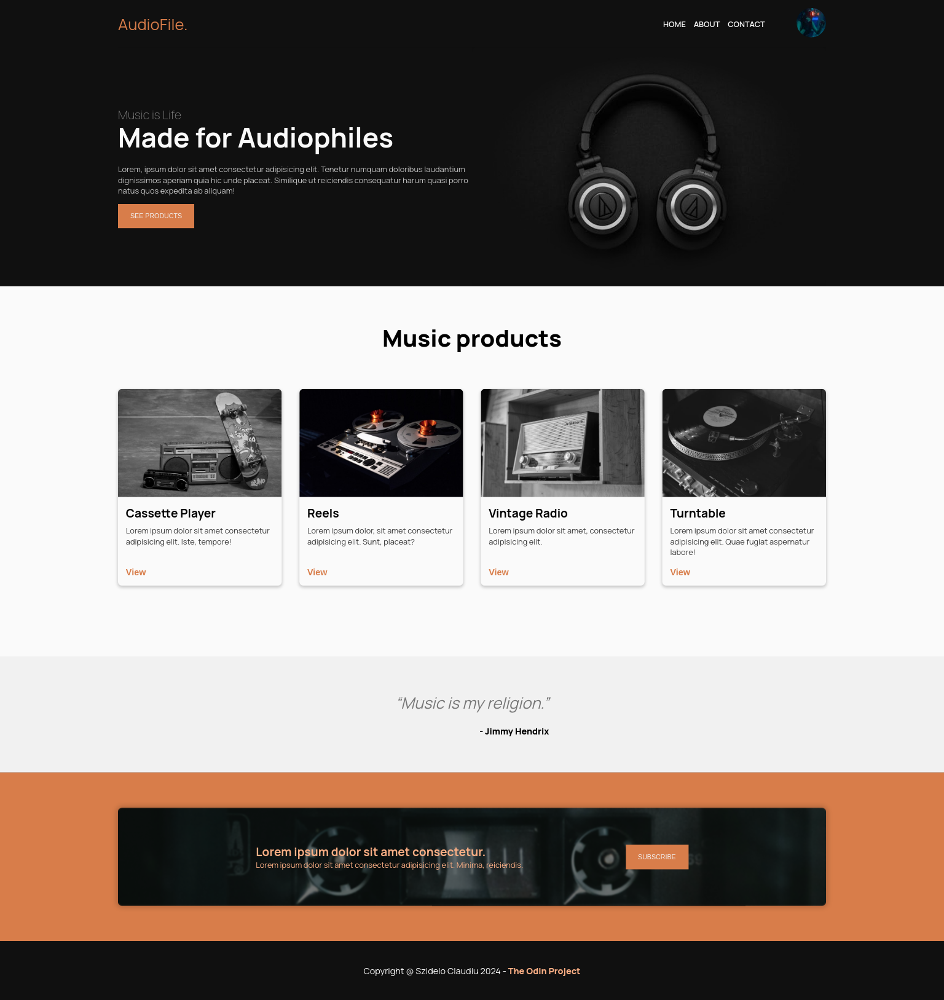

# The Odin Project/Foundations - Audiophile Landing Page

This is my custom solution for the landing page project in foundation chapter - DESKTOP ONLY

## Table of contents

-   [Overview](#overview)
    -   [The challenge](#the-challenge)
    -   [Screenshot](#screenshot)
    -   [Links](#links)
-   [My process](#my-process)
    -   [Built with](#built-with)
-   [Author](#author)

## Overview

### The challenge

The main challenge was to finish the project in less than one day while adding my own design and character.

Users should be able to:

-   View the optimal layout for the web page on desktop size.
-   View the hover effects.

### Screenshot

### Links

-   Solution URL: [Github](https://github.com/Szidelo/odin-landing-page)
-   Live Site URL: [Demo](https://szidelo.github.io/odin-landing-page/)

## My process

### Built with

-   Semantic HTML5 markup
-   CSS custom properties
-   Flexbox

## Author

-   Linkedin - [Claudiu Szidelo](https://www.linkedin.com/in/claudiu-szidelo-671b1324a/)
-   Frontend Mentor - [@Szidelo](https://www.frontendmentor.io/profile/Szidelo)
-   Github - [Szidelo](https://github.com/Szidelo)